# Laporan Praktikum Pemrograman Mobile 
# Modul 6 : Layout dan Navigasi

## Nama     : Zaki Lazuardi Ferysa Putra
## Nim      : 2241720101
## Kelas    : TI-3B / 27
 
## Praktikum 5 : Membangung Navigasi di Flutter
Selesaikan langkah-langkah praktikum berikut ini menggunakan editor Visual Studio Code (VS Code) atau Android Studio atau code editor lain kesukaan Anda. Materi ini dapat dimasukkan ke Laporan Praktikum folder Week atau Pertemuan 06.

Tampilan akhir yang akan Anda buat

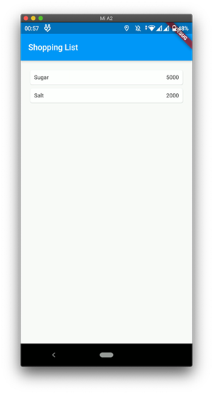 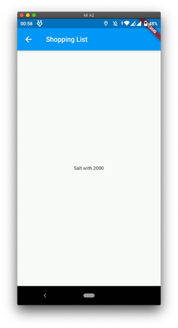

Pada praktikum 5 ini anda akan belajar mengenai pembangunan aplikasi bergerak multi halaman. Aplikasi yang dikembangkan berupa kasus daftar barang belanja. Pada aplikasi ini anda akan belajar untuk berpindah halaman dan mengirimkan data ke halaman lainnya. Gambaran mockup hasil akhir aplikasi dapat anda lihat pada gambar di atas (mockup dibuat sederhana, sehingga Anda mempunyai banyak ruang untuk berkreasi). Desain aplikasi menampilkan sebuah `ListView` widget yang datanya bersumber dari `List`. Ketika item ditekan, data akan dikirimkan ke halaman berikutnya.

### Langkah 1 : Siapkan project baru
Sebelum melanjutkan praktikum, buatlah sebuah project baru Flutter dengan nama belanja dan susunan folder seperti pada gambar berikut. Penyusunan ini dimaksudkan untuk mengorganisasi kode dan widget yang lebih mudah.

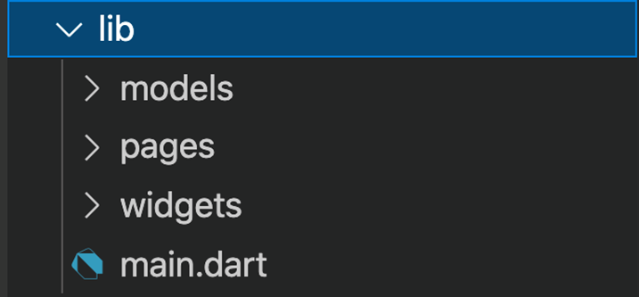

### Langkah 2 : Mendefinisikan Route
Buatlah dua buah file dart dengan nama `home_page.dart` dan `item_page.dart` pada folder pages. Untuk masing-masing file, deklarasikan `class HomePage` pada file `home_page.dart` dan `ItemPage` pada `item_page.dart`. Turunkan class dari `StatelessWidget`. Gambaran potongan kode dapat anda lihat sebagai berikut.

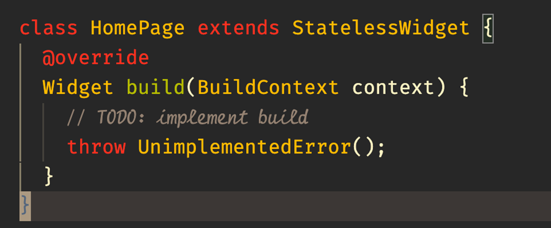

### Langkah 3 : Lengkapi Kode di main.dart
Setelah kedua halaman telah dibuat dan didefinisikan, bukalah file `main.dart`. Pada langkah ini anda akan mendefinisikan Route untuk kedua halaman tersebut. Definisi penamaan route harus bersifat unique. Halaman HomePage didefinisikan sebagai /. Dan halaman ItemPage didefinisikan sebagai /item. Untuk mendefinisikan halaman awal, anda dapat menggunakan `named argument initialRoute`. Gambaran tahapan ini, dapat anda lihat pada potongan kode berikut.

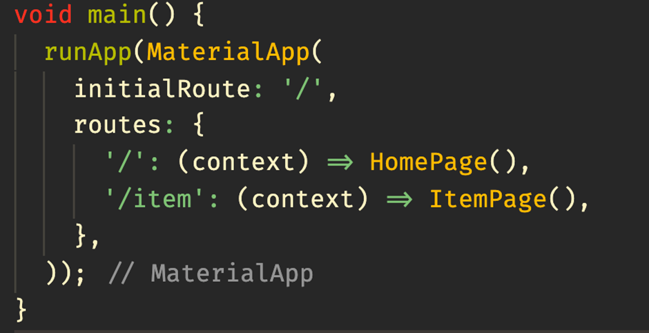

### Langkah 4 : Membuat data model
Sebelum melakukan perpindahan halaman dari `HomePage` ke `ItemPage`, dibutuhkan proses pemodelan data. Pada desain mockup, dibutuhkan dua informasi yaitu nama dan harga. Untuk menangani hal ini, buatlah sebuah file dengan nama `item.dart` dan letakkan pada folder models. Pada file ini didefinisikan pemodelan data yang dibutuhkan. Ilustrasi kode yang dibutuhkan, dapat anda lihat pada potongan kode berikut.

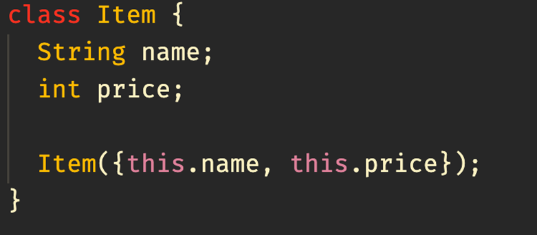

### Langkah 5 : Lengkapi kode di class HomePage
Pada halaman `HomePage` terdapat `ListView` widget. Sumber data `ListView` diambil dari model List dari object Item. Gambaran kode yang dibutuhkan untuk melakukan definisi model dapat anda lihat sebagai berikut.

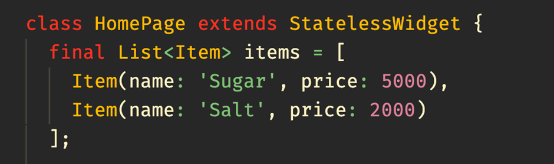

### Langkah 6 : Membuat ListView dan itemBuilder
Untuk menampilkan `ListView` pada praktikum ini digunakan `itemBuilder`. Data diambil dari definisi model yang telah dibuat sebelumnya. Untuk menunjukkan batas data satu dan berikutnya digunakan widget `Card`. Kode yang telah umum pada bagian ini tidak ditampilkan. Gambaran kode yang dibutuhkan dapat anda lihat sebagai berikut.

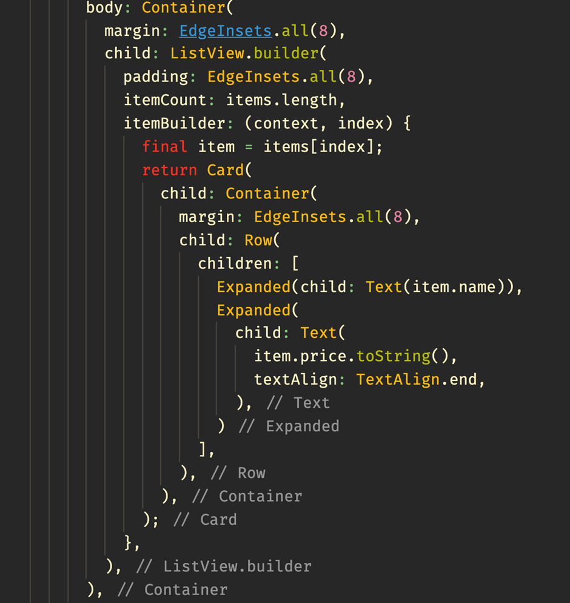

Jalankan aplikasi pada emulator atau pada device anda.

- Hasil

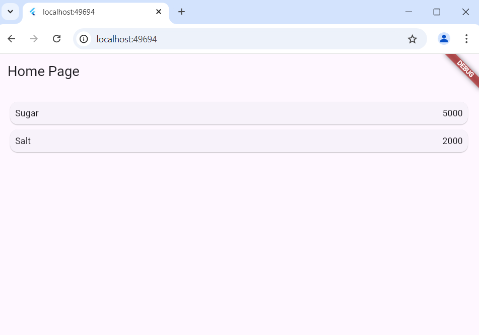

### Langkah 7 : Menambahkan aksi pada ListView
Item pada ListView saat ini ketika ditekan masih belum memberikan aksi tertentu. Untuk menambahkan aksi pada ListView dapat digunakan widget `InkWell` atau `GestureDetector`. Perbedaan utamanya `InkWell` merupakan material widget yang memberikan efek ketika ditekan. Sedangkan `GestureDetector` bersifat umum dan bisa juga digunakan untuk gesture lain selain sentuhan. Pada praktikum ini akan digunakan widget `InkWell`.

Untuk menambahkan sentuhan, letakkan cursor pada widget pembuka `Card`. Kemudian gunakan shortcut quick fix dari VSCode (Ctrl + . pada Windows atau Cmd + . pada MacOS). Sorot menu `wrap with widget...` Ubah nilai widget menjadi `InkWell` serta tambahkan named argument `onTap` yang berisi fungsi untuk berpindah ke halaman `ItemPage`. Ilustrasi potongan kode dapat anda lihat pada potongan berikut.

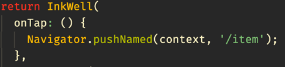

Jalankan aplikasi kembali dan pastikan ListView dapat disentuh dan berpindah ke halaman berikutnya. Periksa kembali jika terdapat kesalahan.

- Hasil Setelah Klik


## Tugas Praktikum 2
1. Untuk melakukan pengiriman data ke halaman berikutnya, cukup menambahkan informasi arguments pada penggunaan `Navigator`. Perbarui kode pada bagian `Navigator` menjadi seperti berikut.

```dart
Navigator.pushNamed(context, '/item', arguments: item);
```
2. Pembacaan nilai yang dikirimkan pada halaman sebelumnya dapat dilakukan menggunakan `ModalRoute`. Tambahkan kode berikut pada blok fungsi build dalam halaman `ItemPage`. Setelah nilai didapatkan, anda dapat menggunakannya seperti penggunaan variabel pada umumnya. (https://docs.flutter.dev/cookbook/navigation/navigate-with-arguments)
```dart
final itemArgs = ModalRoute.of(context)!.settings.arguments as Item;
```

- Kode Program item_page.dart
```dart
import 'package:flutter/material.dart';
import 'package:belanja/models/item.dart';

class ItemPage extends StatelessWidget {
  @override
  Widget build(BuildContext context) {
    final itemArgs = ModalRoute.of(context)!.settings.arguments as Item;

    return Scaffold(
      appBar: AppBar(
        backgroundColor: Colors.blue,
        title: const Text('Shopping List'),
      ),
      body: Center(
        child: 
        Text('${itemArgs.name} with ${itemArgs.price}'),
      ),
    );
  }
}
```

- Hasil

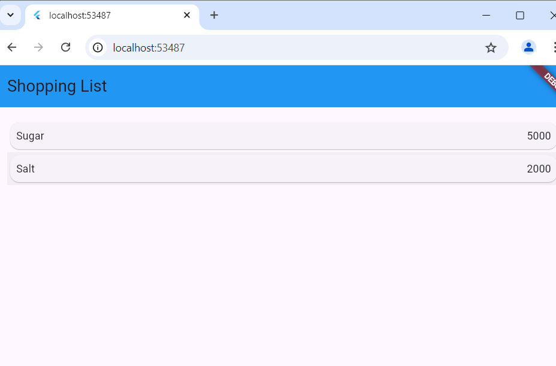 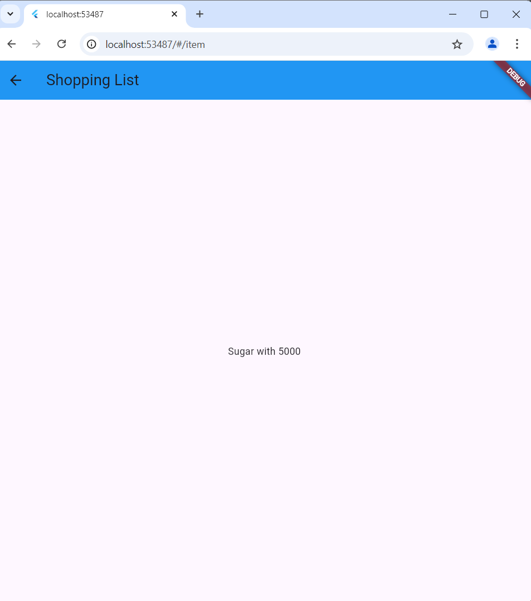


3. Pada hasil akhir dari aplikasi belanja yang telah anda selesaikan, tambahkan atribut foto produk, stok, dan rating. Ubahlah tampilan menjadi `GridView` seperti di aplikasi marketplace pada umumnya.

- Update Models Item
```dart
class Item {
  String name;
  int price;
  String image; 
  int stock; 
  double rating;

  Item({
    required this.name,
    required this.price,
    required this.image,
    required this.stock,
    required this.rating,
  });
}
```

- Update Home Page
```dart
body: Container(
        margin: const EdgeInsets.all(8),
        child: GridView.builder(
          gridDelegate: const SliverGridDelegateWithFixedCrossAxisCount(
            crossAxisCount: 2, // Menentukan jumlah kolom di grid
            crossAxisSpacing: 10,
            mainAxisSpacing: 10,
            childAspectRatio: 3 / 4, // Proporsi aspek item
          ),
          itemCount: items.length,
          itemBuilder: (context, index) {
            final item = items[index];
            return InkWell(
              onTap: () {
                Navigator.pushNamed(context, '/item', arguments: item);
              },
              child: Card(
                child: Column(
                  crossAxisAlignment: CrossAxisAlignment.start,
                  children: [
                    // Gambar produk
                    Expanded(
                      child: Image.network(
                        item.image,
                        fit: BoxFit.cover,
                        width: double.infinity,
                      ),
                    ),
                    Padding(
                      padding: const EdgeInsets.all(8.0),
                      child: Column(
                        crossAxisAlignment: CrossAxisAlignment.start,
                        children: [
                          // Nama produk
                          Text(
                            item.name,
                            style: const TextStyle(
                              fontWeight: FontWeight.bold,
                            ),
                          ),
                          const SizedBox(height: 4),
                          // Harga produk
                          Text('Rp ${item.price}'),
                          const SizedBox(height: 4),
                          // Stok produk
                          Text('Stock: ${item.stock}'),
                          const SizedBox(height: 4),
                          // Rating produk
                          Row(
                            children: [
                              const Icon(Icons.star, color: Colors.yellow, size: 16),
                              Text('${item.rating}'),
                            ],
                          ),
                        ],
                      ),
                    ),
                  ],
                ),
              ),
            );
          },
        ),
      ),
```

- Update Item Page
```dart
import 'package:flutter/material.dart';
import 'package:belanja/models/item.dart';

class ItemPage extends StatelessWidget {
  @override
  Widget build(BuildContext context) {
    // Ambil argument yang dikirim dari halaman sebelumnya (HomePage)
    final itemArgs = ModalRoute.of(context)!.settings.arguments as Item;

    return Scaffold(
      appBar: AppBar(
        backgroundColor: Colors.blue,
        title: Text(itemArgs.name),
      ),
      body: Padding(
        padding: const EdgeInsets.all(16.0),
        child: Column(
          crossAxisAlignment: CrossAxisAlignment.center,
          children: [
            // Tampilkan gambar produk
            Center(
              child: Image.network(
                itemArgs.image,
                height: 400,
                fit: BoxFit.cover,
              ),
            ),
            const SizedBox(height: 16),
            Center(
              child: Text(
                'Name: ${itemArgs.name}',
                style: TextStyle(fontSize: 24, fontWeight: FontWeight.bold),
              ),
            ),
            const SizedBox(height: 16),
            Center(
              child: Text(
                'Price: Rp ${itemArgs.price}',
                style: TextStyle(fontSize: 18),
              ),
            ),
            const SizedBox(height: 16),
            Center(
              child: Text(
                'Stock: ${itemArgs.stock}',
                style: TextStyle(fontSize: 18),
              ),
            ),
            const SizedBox(height: 16),
            // Tambahkan Center di sini untuk rating
            Center(
              child: Row(
                mainAxisSize: MainAxisSize.min, // Agar row mengikuti konten
                children: [
                  Icon(Icons.star, color: Colors.yellow, size: 24),
                  Text(
                    '${itemArgs.rating}',
                    style: TextStyle(fontSize: 18),
                  ),
                ],
              ),
            ),
          ],
        ),
      ),
    );
  }
}
```

- Hasil Akhir

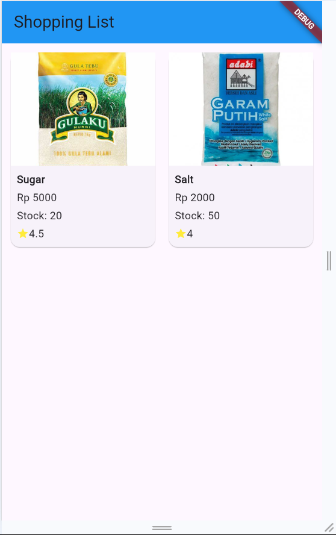 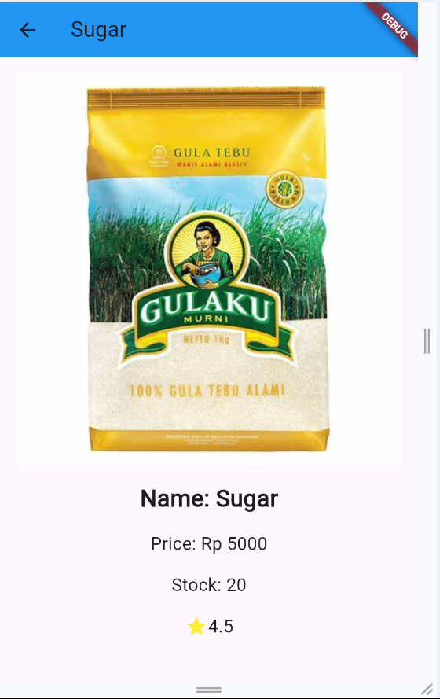

4. Silakan implementasikan `Hero widget` pada aplikasi belanja Anda dengan mempelajari dari sumber ini: https://docs.flutter.dev/cookbook/navigation/hero-animations

- Update Home Page
```dart
Expanded(
  child: Hero(
    tag: 'itemImage-${item.name}', // Unique tag for each item
    child: Image.network(
      item.image,
      fit: BoxFit.cover,
      width: double.infinity,
    ),
  ),
),
```

- Update Item Page
```dart
Center(
  child: Hero(
    tag: 'itemImage-${itemArgs.name}', // Sama seperti tag di HomePage
    child: Image.network(
      itemArgs.image,
      height: 400,
      fit: BoxFit.cover,
    ),
  ),
),
```

- Hasil Akhir

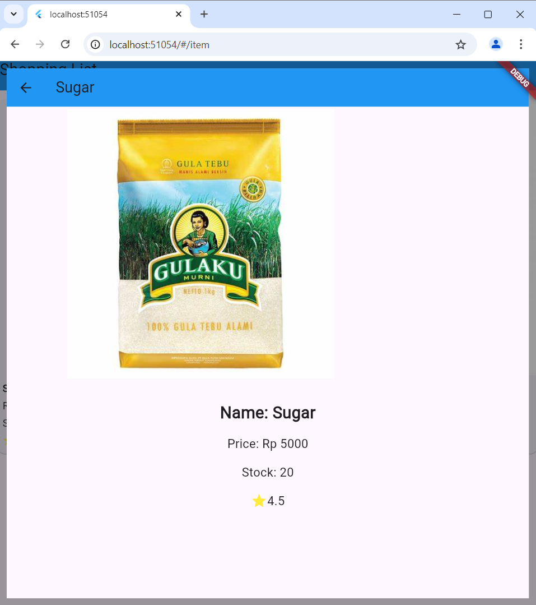

5. Sesuaikan dan modifikasi tampilan sehingga menjadi aplikasi yang menarik. Selain itu, pecah widget menjadi kode yang lebih kecil. Tambahkan Nama dan NIM di footer aplikasi belanja Anda.

- Tambah pada Home Page
```dart
Container(
  color: Colors.blueGrey,
  padding: const EdgeInsets.all(16.0),
  width: double.infinity,
  child: const Text(
    'Nama: Zaki Lazuardi Ferysa Putra | NIM: 2241720101',
    style: TextStyle(color: Colors.white),
    textAlign: TextAlign.center,
    ),
),
```

- Hasil

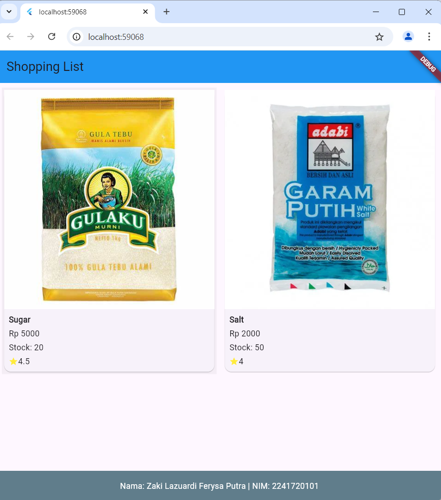

6. Selesaikan Praktikum 5: Navigasi dan Rute tersebut. Cobalah modifikasi menggunakan plugin go_router, lalu dokumentasikan dan push ke repository Anda berupa screenshot setiap hasil pekerjaan beserta penjelasannya di file `README.md`. Kumpulkan link commit repository GitHub Anda kepada dosen yang telah disepakati!

- Update pubspec.yaml
```dart
dependencies:
  flutter:
    sdk: flutter


  # The following adds the Cupertino Icons font to your application.
  # Use with the CupertinoIcons class for iOS style icons.
  cupertino_icons: ^1.0.8
  go_router: ^14.3.0
```

- Update Home Page
```dart
return InkWell(
                    onTap: () {
                      context.go('/item', extra: item);
                    },
                    child: Card(
                      child: Column(
                        crossAxisAlignment: CrossAxisAlignment.start,
                        children: [
                          Expanded(
                            child: Hero(
                              tag: 'itemImage-${item.name}',
                              child: Image.network(
                                item.image,
                                fit: BoxFit.cover,
                              ),
                            ),
                          ),
                          Padding(
                            padding: const EdgeInsets.all(8.0),
                            child: Column(
                              crossAxisAlignment: CrossAxisAlignment.start,
                              children: [
                                Text(
                                  item.name,
                                  style: const TextStyle(
                                    fontWeight: FontWeight.bold,
                                  ),
                                ),
                                const SizedBox(height: 4),
                                Text('Rp ${item.price}'),
                                const SizedBox(height: 4),
                                Text('Stock: ${item.stock}'),
                                const SizedBox(height: 4),
                                Row(
                                  children: [
                                    const Icon(Icons.star, color: Colors.yellow, size: 16),
                                    Text('${item.rating}'),
                                  ],
                                ),
                              ],
                            ),
                          ),
                        ],
                      ),
                    ),
                  );
```

- Update Item Page
```dart
Widget build(BuildContext context) {
    // Ambil argument yang dikirim dari halaman sebelumnya (HomePage)
    final itemArgs = GoRouterState.of(context).extra as Item;

    return Scaffold(
      appBar: AppBar(
        leading: IconButton(
          onPressed: () {
            context.go('/');
          },
          icon: const Icon(Icons.arrow_back),
        ),
        backgroundColor: Colors.blue,
        title: Text(itemArgs.name),
      ),
```